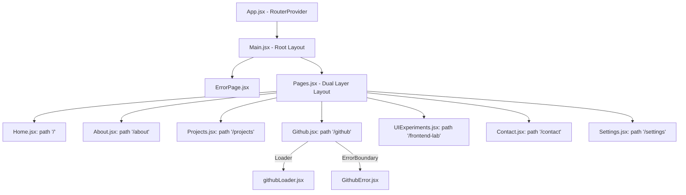
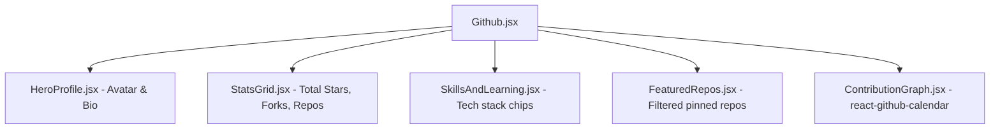

# 🧠 Absolute Brain & Complete Architectural Documentation
**Project:** `My-portfolio-vsc` (v2.0)  
**Author:** Shiv Shankar Singh  
**Design Paradigm:** VS Code / Developer Product / High-End Premium SaaS  
**Core Framework:** React 18 + Vite + Tailwind CSS v4 + Framer Motion  

This document serves as the **Absolute Ground Truth** for this project. Any AI agent, LLM, or human developer working on this codebase MUST treat this document as the definitive architectural blueprint.

---

## 🏗️ 1. Complete System Architecture

### 1.1 Application Routing Tree (React Router v6)
The application relies on a data-driven routing model using `createBrowserRouter` in `src/App.jsx`.



### 1.2 The "Dual-Layer" Layout System (`src/components/Pages.jsx`)
The hallmark of the project's design is a stationary background combined with scrolling foreground content. This is achieved via absolute positioning in `Pages.jsx`.

**The Implementation Pattern:**
```jsx
// Simplified extraction of Pages.jsx
export default function Pages() {
  return (
    <div className="relative h-screen w-full overflow-hidden bg-mainBg text-textColor">
      
      {/* LAYER 1: Z-0 Fixed Background (NEVER SCROLLS) */}
      <div className="absolute inset-0 z-0">
         {/* SVG Grid Pattern */}
         <div className="absolute inset-0 bg-[url('...')] opacity-[0.03]" />
         {/* Glowing Radial Orbs */}
         <div className="absolute -left-[10%] top-0 h-[500px] w-[500px] rounded-full bg-accentColor/10 blur-[120px]" />
      </div>

      {/* LAYER 2: Z-10 Scrolling Content (HOLDS THE OUTLET) */}
      <div className="absolute inset-0 z-10 flex flex-col overflow-y-auto overflow-x-hidden custom-scrollbar">
         <div className="flex flex-1 flex-col">
            <Outlet /> {/* Child pages render here */}
         </div>
      </div>
    </div>
  )
}
```
**CRITICAL RULE:** Because Layer 1 handles the background, child routes (like `About.jsx`, `Projects.jsx`) **MUST NOT** apply opaque backgrounds (like `bg-mainBg`) to their root wrappers. They must remain transparent (`bg-transparent` or omitted) to let the grid shine through.

---

## 🎨 2. Styling Engine & Theme System

### 2.1 Tailwind CSS v4 & Root Variables (`src/index.css`)
Tailwind v4's `@theme` directive maps internal utility classes directly to dynamic CSS variables. This powers the global theme switching.

**The CSS Variable Schema (`:root` / `[data-theme='dark']`):**
```css
:root {
  --mainBg: #1e1e1e;           /* Deep editor background */
  --articleBg: #252526;        /* Slightly elevated panels */
  --titlebarBg: #333333;       /* Header / Nav bars */
  --explorerBorder: rgba(255, 255, 255, 0.1); /* 1px panel dividers */
  --textColor: #cccccc;        /* Primary reading text */
  --bgText: rgba(255, 255, 255, 0.02); /* Massive background watermarks */
  --accentColor: #007acc;      /* Vibrant interactive elements (Blue/Orange/Teal) */
}
```

**Global Resets:**
- Font Family: `'Inconsolata', monospace` is applied to `body`.
- Scrollbar: Custom pseudo-classes (`::-webkit-scrollbar`) are themed to match the `articleBg` and `accentColor`.

### 2.2 Global Width Strictness
Every page in the application conforms to a rigid, mathematical layout to prevent UI shifting:
- **`max-w-6xl mx-auto` (Max Width: 1152px):** The absolute standard for `About.jsx`, `Projects.jsx`, `Github.jsx`, `UIExperiments.jsx`, and `Contact.jsx`.
- **`max-w-7xl` (Max Width: 1280px):** Exclusively permitted for `Home.jsx` to allow the Hero illustration to stretch further.

---

## 🔌 3. API, State, and Data Schemas

### 3.1 Context Provider (`src/context/ThemeContext.jsx`)
- **State Managed:** `theme` (String).
- **Persistence:** Synchronizes with `localStorage.getItem('theme')`.
- **Side Effects:** A `useEffect` hook watches `theme`, removes the previous theme class from `document.documentElement`, and applies the new one (e.g., `<html class="theme-dark">`).

### 3.2 GitHub API Architecture
**`src/services/apiGithub.js`**
- Uses `axios` to execute concurrent GET requests via `Promise.all()`.
- **Target 1:** `https://api.github.com/users/sh1v-max`
- **Target 2:** `https://api.github.com/users/sh1v-max/repos?per_page=100`
- **Error Handling:** Contains specific interception for Status `403`. Unauthenticated requests to GitHub are capped at 60/hr. If `error.response?.status === 403`, it explicitly throws a "Rate limit exceeded" error.

**Data Flow Sequence:**
1. React Router matches `/github`.
2. `githubLoader.jsx` fires `getUser()`.
3. If successful, `Github.jsx` renders. It accesses data via `const { user, repos } = useLoaderData()`.
4. If failed, the Router halts and renders `GithubError.jsx`, displaying the exact thrown error message.

### 3.3 Internal Data Schemas
**Projects Data Schema (`src/features/projects/projectsData.js`):**
```javascript
{
  id: "netflix-gpt",
  title: "Netflix GPT",
  description: "A full-stack Netflix clone...",
  image: "...",
  technologies: ["React", "Firebase", "Redux"],
  liveUrl: "https://...",
  githubUrl: "https://..."
}
```

**Frontend Lab Data Schema (`src/features/frontend-lab/data/uiExperimentsData.js`):**
```javascript
{
  id: "glass-card",
  title: "Glassmorphism Card",
  category: "UI",       // Used for tab filtering
  level: "Beginner",    // Used for tab filtering
  component: "<GlassCard />", // The rendered component
  code: "div className='backdrop-blur-md...'" // Displayed code snippet
}
```

---

## 🖥️ 4. Exhaustive Component Breakdowns

### 4.1 Home Page (`src/features/home/`)
- **`Home.jsx`:** The entry point. It features heavily staggered text scaling via Framer Motion. 
- **`Illustration.jsx` (and 10X, 20X, 30X, 40X, 100X variants):** These are complex, autonomous 3D CSS components. They use `transformStyle: "preserve-3d"` and `perspective: "1000px"` to create holographic effects like spinning geometric shapes, animated syntax code blocks, and orbiting SVGs.

### 4.2 GitHub Dashboard (`src/features/github/`)
An intricately componentized dashboard.


### 4.3 Frontend Lab (`src/features/frontend-lab/`)
- **State Management:** `UIExperiments.jsx` holds `searchQuery`, `selectedLevel`, and `selectedCategory` in local `useState`.
- **Performance:** `filteredProjects` is memoized via `useMemo` calling `filterUtils.js` to ensure the complex UI grid doesn't choke rendering during fast typing in the `SearchBar`.

### 4.4 Contact Form (`src/features/contact/Contact.jsx`)
- **Library:** `react-hook-form` is used to register inputs (`name`, `email`, `subject`, `message`) with Regex validations (e.g., standard email validation pattern).
- **EmailJS Integration:** In the `onSubmit` handler, `emailjs.sendForm` is called. It passes a `useRef` of the HTML form and securely references environment variables (`import.meta.env.VITE_SERVICE_ID`, etc.).
- **Toasting:** `toast.promise` visually represents the pending, successful, or rejected state of the EmailJS promise.

---

## ☢️ 5. Critical Code Constraints & Fixes (DO NOT REVERT)

### 5.1 The `react-github-calendar` ESM Interop Fix
Vite handles CommonJS modules uniquely. `react-github-calendar` (v4) exports its default component wrapped inside a `.default` property when processed by Vite's dev server.
- **The Error:** `Element type is invalid: expected a string... but got: object.`
- **The Exact Code Fix located in `ContributionGraph.jsx`:**
```javascript
import CalendarModule from "react-github-calendar";
// CRITICAL: Unwraps the CJS object to get the actual React Function Component
const ActivityCalendar = CalendarModule.default || CalendarModule;

export default function ContributionGraph({ theme }) {
  return <ActivityCalendar username="sh1v-max" theme={theme} />
}
```
**DO NOT** change this to `import ActivityCalendar from 'react-github-calendar'` or it will instantly trigger a fatal application crash.

### 5.2 Framer Motion Global Variants
To maintain animation consistency, most pages use a standardized staggering variant system. Do not deviate from these curves:
```javascript
const containerVariants = {
  hidden: { opacity: 0 },
  show: {
    opacity: 1,
    transition: { staggerChildren: 0.15, ease: "easeOut" },
  },
};

const itemVariants = {
  hidden: { opacity: 0, y: 20 },
  show: { opacity: 1, y: 0, transition: { duration: 0.5, ease: "easeOut" } },
};
```

---

## 🚀 6. Immediate Action Items & Roadmap
1. **Remove Home Page Showcase:** The `Home.jsx` file currently has a temporary "Illustration Showcase" block rendering all experimental illustrations (10X through 100X). The ultimate goal is to select one, elevate it to the primary `<Illustration />` spot, delete the showcase code, and delete the unused illustration files.
2. **GitHub API Authorization:** The GitHub API frequently hits 403 Rate Limits on `localhost` due to the 60 requests/hr unauthenticated cap. 
   - *Fix:* Create a `.env` file with `VITE_GITHUB_TOKEN`.
   - *Implementation:* Pass `{ headers: { Authorization: \`token \${import.meta.env.VITE_GITHUB_TOKEN}\` } }` to the Axios calls in `apiGithub.js`.
3. **Finish Theme Implementation:** The application structure supports full theme switching via `ThemeContext`, but the UI trigger (a dropdown or toggle in `Settings.jsx` or the `Navbar`) needs to be fully implemented to switch `localStorage` values between 'dark', 'light', 'dracula', etc.

---
*DOCUMENT END.*
